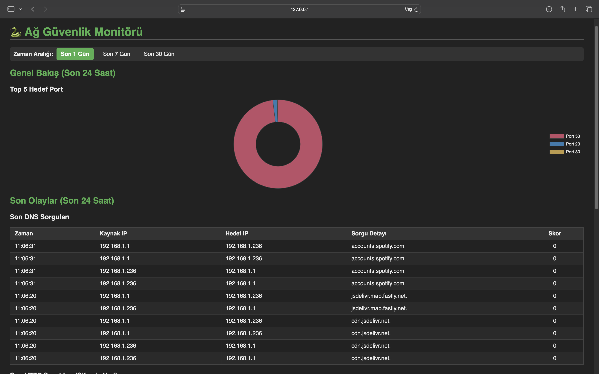

This project is developed in order to monitor the local network traffic and detect suspicious events. The analyzer utilizes scapy to capture packets in real time (e.g., insecure port detection, leaks over HTTP), In addition the system integrates with AbuseIPDB API to enrich alerts. thus, it scans extensively with up to date threats by AbuseIPDB. The local network traffic and findings stored in a PostgreSQL. 

Features:

1. Real-time packet sniffing.

2. Threat detection:
-Suspicious port detection
-HTTP data leaks

3.Threat Intelligent:
-Sends queries and fetch the confidence score to identify reliability of IP adresses. 
- A cache memory was applied to prevent API rate limits , Whereby API usage became more efficient.

4. PostgreSQL database was used to log events and in this way, concurrency was prevented. Thereby resolved the concurrency error which encountered with SQLite. 

5.Interactive Dashboard:
-Flask backend 
-Chart.js
-Dynamic Filtering
-Highlights for high risk events.

6. Real-Time alerts: Sends a desktop notification, if it encounter a high risk event.

Installation Guide:

1. Clone the repository

git clone https://github.com/doganbilir/network-ids.git
cd network-ids

2. Set Up PostgreSQL

CREATE DATABASE netmonitor_db;
CREATE USER user_name WITH PASSWORD 'password';
GRANT ALL PRIVILEGES ON DATABASE netmonitor_db TO netmonitor_user;

3. Configure the project

Create your config.py file, example config file added, just API key should be added.

4.pip3 install -r requirements.txt

Usage

5. Enable scripts with these terminal codes

chmod +x start_dashboard.command
chmod +x start_sniffer.command

6.Start the Dashboard(double-click start_dashboard.command). Then launch at the webserver.

7. Start the Sniffer(double-click start_sniffer.command). 

Test: To test the project, use the vulnweb(http://www.vulnweb.com) or run the test_suspicious_port.sh